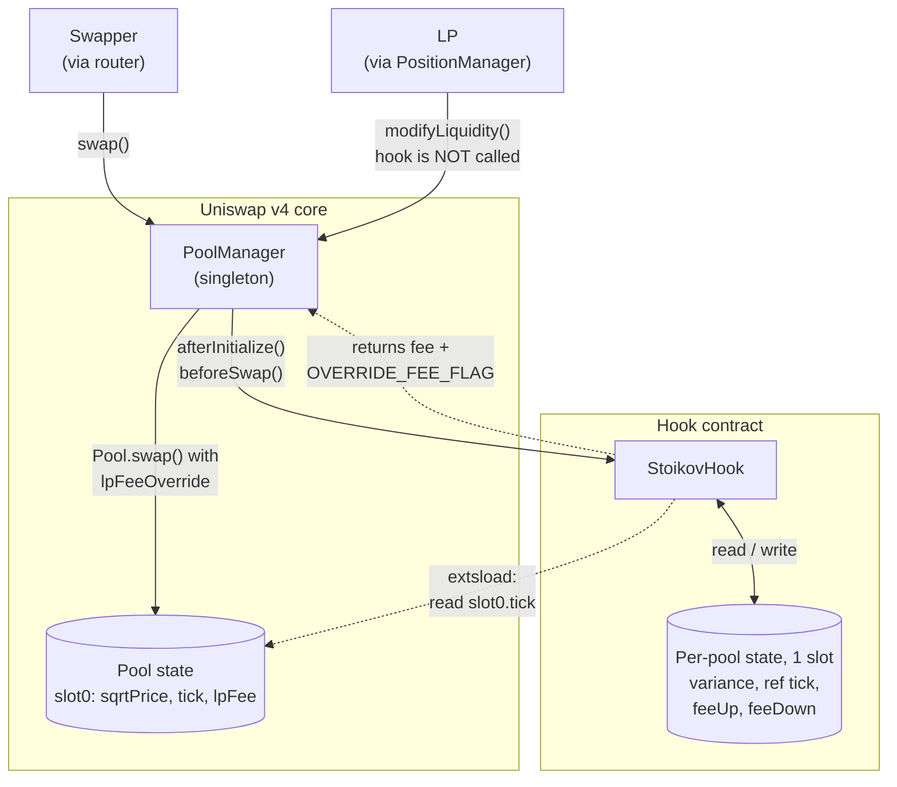
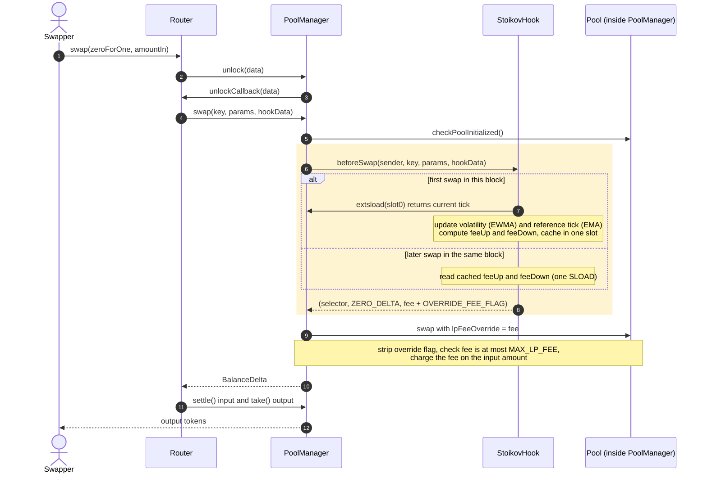
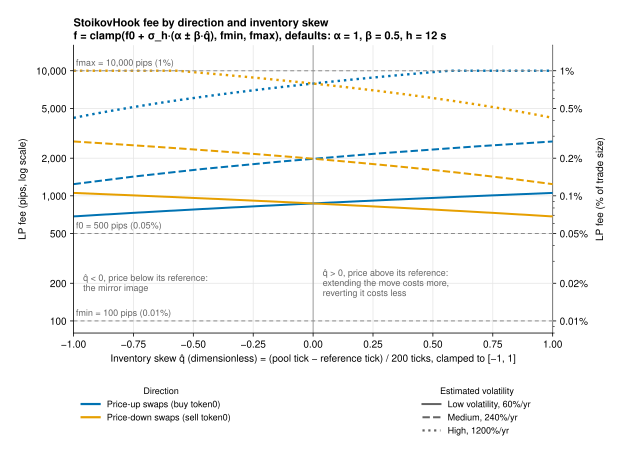
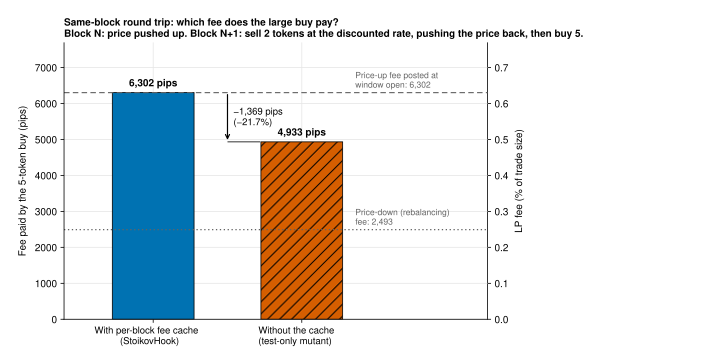
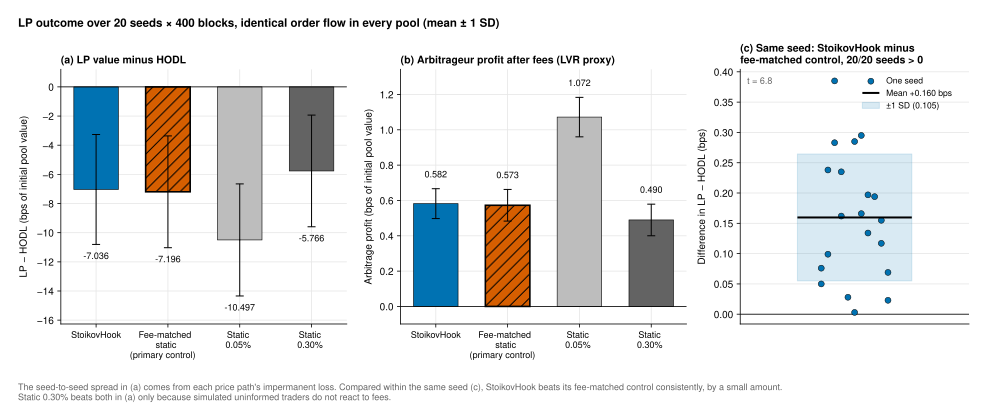
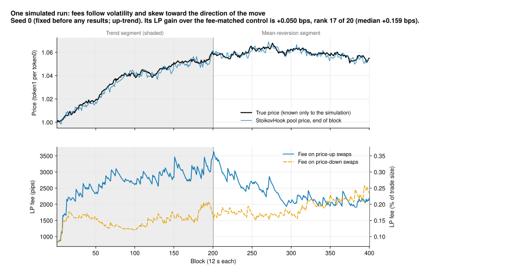
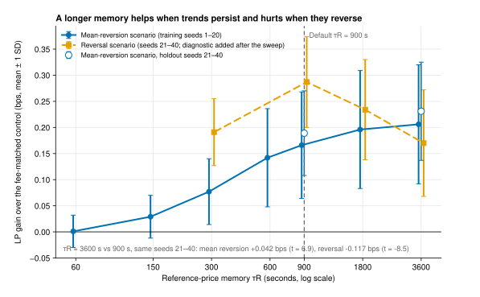

<p align="center">
  
</p>

# StoikovHook

**A Uniswap v4 hook that sets swap fees the way a professional market maker sets spreads. Fees widen with volatility and skew against the pool's inventory, so arbitrageurs pay more of the value they extract back to LPs as fees, while uninformed traders pay no more.**

> Built at ETHGlobal Tokyo 2026

> [!NOTE]
> **Project status: fee model implemented, tested and simulated; deployed and source-verified on Sepolia.** The fee model specified and approved in [`specs/01-design.md`](specs/01-design.md) is implemented in [`src/StoikovHook.sol`](src/StoikovHook.sol). Default parameters are placeholders until calibration.
> Status legend: ✅ Done · 🚧 In progress · 📋 Planned. Anything not marked ✅ is **not** done.

## Problem

A Uniswap pool is a market maker that never updates its quote. Its fee (its half-spread) is fixed when the pool is created, and its price only moves when someone trades against it. Between blocks, the price on centralized exchanges keeps moving. Once the gap exceeds the fee, an arbitrageur trades the pool back into line and the LPs fill that trade at a stale price. This loss is known as *loss-versus-rebalancing* (LVR). It grows with the square of volatility, and a static fee is mis-sized in both directions: too expensive for ordinary traders in calm markets, and far too cheap for arbitrageurs when volatility spikes.

A professional market maker on a centralized exchange does not quote passively. In the Avellaneda–Stoikov model, the dealer widens the spread when volatility rises and shifts both quotes against its inventory. That makes trades which rebalance its position cheap and trades which worsen it expensive. Uniswap LPs have neither tool.

## Solution

StoikovHook gives a v4 pool both tools. For every block it computes two fees from the pool's own on-chain state: one for swaps that push the price up and one for swaps that push it down. A volatility premium raises both fees when the market is moving. An inventory skew charges more to swaps that push the pool further from its recent equilibrium and less to swaps that bring it back. The fee is applied per swap through v4's dynamic-fee override. There is no oracle, no admin key, and the hook never takes custody of tokens.

In simulation, the effect is to move more of the value that arbitrage extracts to LPs: arbitrageurs pay higher fees, and uninformed traders pay the same average fee. The gain over a comparable static-fee pool is consistent but small; see [Simulation Results](#results) and [Limitations](#limitations).

## Goals

Each goal is a measurable outcome with a named way to check it. Results are published here **whether or not** they meet the goal.

| # | Goal | How it is verified | Status |
|---|---|---|---|
| G1 | **Better LP outcome for the same cost to traders.** Under identical order flow (same price path, same arbitrage and uninformed trades), LPs in the StoikovHook pool end with a higher terminal value, marked to the reference price, than LPs in a static-fee pool charging the same average fee to uninformed traders. Results against static 0.05% and 0.30% pools are reported alongside. | Deterministic Foundry simulation comparing four pools ([method and data](docs/simulation/README.md)) | ✅ Met, with a small effect: +0.160 ± 0.105 bps against the fee-matched pool, positive in 20/20 seeds, t = 6.8, recovering ≈ 2.2% of the LP's loss versus HODL ([results](#results)) |
| G2 | **Direction-aware fees on a live network.** On Sepolia, swaps in opposite directions pay different fees, as recorded in the `fee` field of the PoolManager's own `Swap` event. | Published transaction hashes, verified hook source | ✅ Met: in consecutive blocks, a price-down swap paid 1,987 pips and a price-up swap paid 2,799 pips; each block's `FeeWindowUpdated` event shows both sides (2,949 / 1,987 and 2,799 / 2,067). Source verified on Etherscan ([deployment record](docs/deployments/sepolia.md)) |
| G3 | **The hook never blocks trading.** Every fee stays within [0.01%, 1%], and no swap reverts inside the hook. | Fuzz tests (≥ 1,000 runs) over random swap sequences and time gaps | ✅ Done (see [Security](#security)) |
| G4 | **Low gas overhead.** ≤ 5,000 gas for swaps that reuse the block's cached fees, and ≤ 25,000 gas for the first swap of a block. | Foundry gas snapshots, recorded in the build log | ✅ Done, warm measurement (see [Gas](#gas)) |

## Architecture

> The diagrams match the implementation in [`src/StoikovHook.sol`](src/StoikovHook.sol) and the design in [`specs/01-design.md`](specs/01-design.md).

**(a) Components.** Solid arrows are calls; dotted arrows are return values and read-only access.



**(b) Lifecycle of one swap.** The highlighted block is where StoikovHook runs. It is called in step 6, reads the pool's tick in step 7 (first swap of a block only) and returns the fee override in step 8.



## Core Features

| Feature | Description | Status |
|---|---|---|
| Project scaffolding | Foundry project built on the v4 template, with compiler settings pinned so the CREATE2-mined hook address is reproducible. | ✅ Done |
| Hook skeleton | `afterInitialize` + `beforeSwap` permissions (address flags `0x1080`), a dynamic-fee guard, a stored fallback fee of 0.05%, and a per-swap fee override. | ✅ Done |
| Dynamic fee computation | Each block has two fees, one for price-up swaps and one for price-down swaps, applied per swap through v4's `OVERRIDE_FEE_FLAG`. | ✅ Done |
| Inventory skew | Swaps that push the pool away from its recent equilibrium (an EMA of its own tick) pay more, and swaps that bring it back pay less. | ✅ Done |
| Volatility estimation | On-chain EWMA of realized volatility from the pool's own ticks, updated once per block, with no oracle. | ✅ Done |
| Fee bounds protection | Every fee is clamped to a floor and a cap (default 0.01%–1%), and the fee calculation is designed never to revert a swap. | ✅ Done |
| Per-block fee snapshot | Fees are fixed for the whole block, so trading back and forth within a block cannot lower your own fee. | ✅ Done |
| Test suite | 35 hook tests: integration tests through PoolManager, fee-math unit tests, fuzz tests (1,000–5,000 runs) and gas tests. | ✅ Done |
| Comparison simulation | A deterministic Foundry simulation (20 seeds × 400 blocks) that runs identical arbitrage and noise flow through StoikovHook, a fee-matched static pool and static 0.05% / 0.30% pools, and reports LP − HODL, fee income and arbitrage profit. | ✅ Done |
| Sepolia deployment | Hook deployed at a mined address with flags `0x1080`, source verified, and a demo pool with swaps in both directions. | ✅ Done ([record](docs/deployments/sepolia.md)) |

## Non-Goals

What StoikovHook deliberately does **not** do:

- **No price oracle and no keeper.** The hook only reads the pool's own on-chain state. There are no Chainlink or Pyth feeds and no off-chain bot pushing updates.
- **No trading frontend.** You interact through scripts and existing v4 routers. A read-only fee dashboard is at most a stretch idea, not a trading UI.
- **No custom curve and no token custody.** The hook never changes swap amounts (no return-delta flags), never holds tokens and never runs on liquidity add/remove.
- **No admin, governance or upgradeability.** Parameters are fixed at deployment; a different parameter set means a new hook and a new pool.
- **Not a full LVR solution.** The aim is to shrink the share of LVR that arbitrageurs capture, not to eliminate it. This is not an MEV auction, a batch auction or an oracle-priced AMM.
- **No mainnet deployment and no production calibration.** The hook runs on Sepolia only, is unaudited, and its default parameters are placeholders until calibrated.

## How It Works

> Implemented in [`src/StoikovHook.sol`](src/StoikovHook.sol). Parameter values are placeholders until calibration.

Picture the pool as a currency-exchange booth that posts two prices, one for buying ETH and one for selling it.

1. **Calm market: small fee.** When prices barely move, both directions pay a low base fee, so ordinary traders are not overcharged.
2. **Choppy market: both fees rise.** Fast-moving prices are when arbitrage bots profit at LPs' expense, so the booth charges a higher premium on both sides, much as insurance costs more in storm season. The premium follows how much the pool's own price has been moving recently.
3. **Unbalanced booth: prices tilt.** If the booth has recently sold a lot of ETH, its price has risen above its recent average. It then charges more to anyone buying even more ETH and gives a discount to anyone selling ETH back. Trades that help the pool recover its balance are cheaper; trades that push it further out are more expensive.
4. **One price list per block.** Both fees are set at the first trade of each block and stay fixed until the next block. Trading back and forth within a block therefore cannot move your own fee.
5. **Always a floor and a cap.** Fees never go below a minimum or above a maximum (defaults 0.01% and 1%), so the pool stays usable even in a crash.



*The two directions share one fee when the pool sits at its reference (q̂ = 0) and split apart as it moves away: the side that extends the move pays more. Higher volatility lifts both sides. Computed from the contract's formula and `defaultFeeParams()`, not from simulation.*

The math behind each step, and why it follows the Avellaneda–Stoikov model, is in [`specs/01-design.md`](specs/01-design.md) §2.

## Security

What the tests guarantee, and the evidence that the design choices matter:

- **Fees are always bounded, and the hook never blocks a swap.** Fuzz tests drive the fee math with any variance, any displacement and any valid parameter set (5,000 and 1,000 runs), and drive real swap sequences across random blocks and time gaps (1,000 runs). Every fee lands in [fmin, fmax], and no input makes the hook revert.
- **Neither side ever drops below f0.** The constructor rejects β > α (`src/StoikovHook.sol:L294`). A boundary test checks that β = α puts the rebalancing side exactly on f0.
- **Per-block fee caching is necessary, not cosmetic.** Mutation testing deliberately breaks the code and checks that the tests catch it:

  | Mutation | Tests that fail (of 41) | What it shows |
  |---|---|---|
  | Flip the sign of the inventory skew | 10 (9 of 40 before the β = α boundary test was added) | The skew-direction tests and all three fuzz invariants catch a reversed skew. |
  | Remove per-block caching (recompute fees on every swap) | 7 | Reproduces the attack in spec §5.4: after a round trip within one block, the large buy pays 4,933 pips instead of the 6,302 it pays with the cache. This is direct evidence that the cache is required. |

- **Minimal trust surface.** Only PoolManager can call the hook. There is no owner, no mutable parameter, no oracle and no token custody. The hook registers no liquidity callbacks, so LPs can always withdraw.
- **Known limitations** are listed in [spec §5.5](specs/01-design.md#55-known-limitations).



*With the per-block cache, the large buy pays the price-up fee posted when the block's fee window opened, however the attacker trades first. Without it, a cheap sell through the reference turns the next buy into a "rebalancing" trade, and the fee drops by 22%. The data comes from `test/simulation/AttackDefense.t.sol`, which runs the same sequence against StoikovHook and a test-only mutant without the cache.*

## Gas

Extra gas StoikovHook adds to a swap, measured by [`test/StoikovHookGas.t.sol`](test/StoikovHookGas.t.sol) (`forge test --match-contract StoikovHookGasTest -vv`): the same 1e18 swap in the hooked pool minus the same swap in an identical hookless pool.

| Path | Warm | Cold | Budget (warm) |
|---|---|---|---|
| Later swaps in a block (cached fees) | 3,678 | 5,678 | ≤ 5,000 ✅ |
| First swap of a block (fee window opens) | 14,905 | 16,905 | ≤ 25,000 ✅ |
| For scale: the same swap in a hookless pool | 40,120 | 48,120 | — |

- **Warm**: both pools were touched earlier in the transaction. This is the methodology of the skeleton's 2,093-gas baseline, and the budgets apply to it (spec §6, A8).
- **Cold**: storage is first marked untouched with `vm.cool`. The extra 2,000 gas is the cold read of the pool's state slot, an inherent cost for any hook that keeps per-pool state. Treat the cold figures as a lower bound: the first call to the hook address in a real transaction also pays about 2,500 gas for cold account access, which this measurement does not capture.
- **Relative cost**: about +9% on the cached path and +37% on the first swap of a block, compared with the hookless swap's execution gas. A full transaction also pays the 21,000-gas base cost and calldata, so the share of the total is smaller.

## Results

A deterministic Foundry simulation: 20 seeds × 400 blocks (a trend segment, then a mean-reverting segment), with identical arbitrage and noise flow in every pool. Run it with `FOUNDRY_PROFILE=sim forge test -vv`. The full method, per-seed data and caveats are in [`docs/simulation/README.md`](docs/simulation/README.md).

| Pool | LP − HODL (bps of pool value) | Arbitrageur's share of the value it extracts |
|---|---|---|
| StoikovHook | −7.036 ± 3.771 | 30.3% |
| Fee-matched static, 0.22% (the control) | −7.196 ± 3.834 | 32.9% |
| Static 0.05% | −10.497 ± 3.844 | 68.4% |
| Static 0.30% | −5.766 ± 3.830 | 26.6% |

- **Against the fee-matched control, same seed:** LP − HODL is **+0.160 ± 0.105 bps**, positive in **20 of 20** seeds, t = 6.8. That recovers about 2.2% of the LP's loss versus HODL. The effect is consistent but small.
- **Mechanism:** StoikovHook moves more of the value that arbitrage extracts to LPs. The arbitrageur pays +0.175 bps more in fees; uninformed traders pay the same (difference 0.000 ± 0.001 bps).
- **Where the gain comes from:** the trend segment (+0.179 bps of arbitrage fees, positive in 20 of 20 seeds). The mean-reversion segment shows no gain (−0.004 ± 0.024).



*Read panel (c) first. Within each seed, StoikovHook beats the fee-matched control every time, by a small amount. Panel (a) hides this because each price path's impermanent loss moves all four pools together. Panel (b) shows why static 0.05% does worst: arbitrage profit there is nearly twice as large.*



*During the trend, the fee on swaps that continue the move stays well above the fee on swaps that reverse it. After the trend ends, the gap closes only slowly, because the reference price is a slow average; that lag is why the mean-reversion segment shows no gain. Seed 0 was fixed before any results existed, and its gain is below the median.*

## Limitations

- **Uninformed flow does not react to fees in the model.** That is why the static 0.30% pool has the best absolute LP − HODL: it charges uninformed traders more and loses no volume. In reality, higher fees push volume to other pools, which is why every claim here is made against the fee-matched pool.
- **StoikovHook does not lower LVR in absolute terms.** The arbitrageur's profit is not lower; it is 1.6% higher. What falls is its share of the value it extracts, from 32.9% to 30.3%. This project does not claim to reduce the absolute size of LVR.
- **The gain appears only in the trend segment.** In the mean-reversion segment the effect is zero, because the slow reference price still lags the end of the trend, so reversal-direction arbitrage gets the discount.
- **Parameters are calibrated on a single type of price generator.** The τR experiment ([details](docs/simulation/README.md#calibration-experiment-reference-memory-τr)) shows that the best memory depends on the regime, and real markets switch regimes in more complex ways.
- **One stylized scenario with default parameters.** The arbitrageur has no gas cost or latency, there is a single full-range LP, and there are no competing venues. See [`docs/simulation/README.md`](docs/simulation/README.md#limitations) and [spec §5.5](specs/01-design.md#55-known-limitations).



*The best reference memory depends on the regime. A long memory wins when a trend persists and loses more when it reverses. The default of 900 s is the most robust of the values tested, not the best in either scenario alone.*

## Tech Stack

- **Solidity** 0.8.30. Compiler settings are pinned in `foundry.toml` because the CREATE2-mined hook address depends on the exact bytecode.
- **Foundry** (forge, anvil, cast) for building, testing, the local Sepolia fork and deployment.
- **Uniswap v4-core / v4-periphery**, pulled in through OpenZeppelin **uniswap-hooks** v1.1.0 (hook base contracts).
- **hookmate** for v4 deployment artifacts and address constants.
- **Solady** v0.1.26 `FixedPointMathLib` for the fee math: integer square root, WAD multiplication and clamps.
- **Sepolia** as the target testnet.

## Repository Guide

> Line numbers refer to the current `main` branch. Items still in progress are marked 🚧.

| What to verify | Location | Status |
|---|---|---|
| Hook permissions (`afterInitialize` + `beforeSwap`, address flags `0x1080`) | `src/StoikovHook.sol:L18` — flag constant shared with the deploy script and tests; `lib/uniswap-hooks/src/fee/BaseOverrideFee.sol:L75-L92` — inherited permission set | ✅ Done |
| Dynamic-fee guard, state seeding and stored fallback fee (`afterInitialize`) | `src/StoikovHook.sol:L174-L196` — rejects static-fee pools, seeds the estimators, stores f0 as the fallback LP fee | ✅ Done |
| Per-swap fee override returned from `beforeSwap` | `src/StoikovHook.sol:L200-L219` — opens the fee window on a block's first swap, returns the cached fee for the swap's direction; `lib/uniswap-hooks/src/fee/BaseOverrideFee.sol:L67` — adds `OVERRIDE_FEE_FLAG` | ✅ Done |
| Fee formula: volatility premium, inventory skew, clamps | `src/StoikovHook.sol:L260-L286` — f = clamp(f0 + σ_h·(α ± β·q̂), fmin, fmax) | ✅ Done |
| Estimator update at window open (EWMA volatility, EMA reference) | `src/StoikovHook.sol:L222-L254` — elapsed time floored at 1 s, tick change winsorized at ±C | ✅ Done |
| Parameters and deploy-time validation | `src/StoikovHook.sol:L22-L69` — `FeeParams` and the defaults with their rationale; `src/StoikovHook.sol:L290-L299` — invariants, including β ≤ α | ✅ Done |
| Sepolia demo deployment | `script/sepolia/DeployDemo.s.sol:L48-L83` — mines the salt (L54-L57), deploys the hook via CREATE2 (L62), then the pool and three demo swaps in separate blocks (L65-L73); `script/sepolia/DeployDemo.s.sol:L103-L122` — pool initialization and full-range mint in one multicall | ✅ Deployed on Sepolia ([record](docs/deployments/sepolia.md)) |
| Address mining and CREATE2 deployment | `script/00_DeployHook.s.sol:L18-L35` — mines with the shared flag constant and the encoded fee parameters, deploys via CREATE2 | ✅ Done (local anvil). The Sepolia hook was deployed by the demo script above, which mines the same way |
| Integration tests through PoolManager | `test/StoikovHook.t.sol` — permissions and initialization (L30-L83), charged fee vs. stored fee (L85-L113), skew direction (L115-L145), volatility response (L147-L170), per-block caching (L172-L212), fuzzed swap sequences (L214-L237) | ✅ Done |
| Fee-math unit and fuzz tests | `test/StoikovHookFees.t.sol` — skew (L29-L78), volatility (L80-L104), bounds for any input and parameters (L106-L127), window update (L129-L196), parameter validation (L198-L277) | ✅ Done |
| Gas tests | `test/StoikovHookGas.t.sol` | ✅ Done |
| Round-trip attack data (with and without the per-block cache) | `test/simulation/AttackDefense.t.sol`; `test/simulation/StoikovHookNoCache.sol` — test-only mutant, never deployed | ✅ Done |
| Figures | `script/plots/make_figures.py` — every number read from `docs/simulation/` or computed from `defaultFeeParams()`; SVGs in `docs/figures/`, 1600-pixel-wide PNGs of the same figures in `docs/figures/png/` | ✅ Done |
| Comparison simulation | `test/simulation/ComparisonSimulation.t.sol` — price path, arbitrage and noise flow, fee-matched control, metrics; `test/simulation/SimTrader.sol`, `test/simulation/SimLiquidityProvider.sol` — participants; [`docs/simulation/`](docs/simulation/README.md) — results and method | ✅ Done |
| Design specification | [`specs/01-design.md`](specs/01-design.md) | ✅ Approved |

## Getting Started

Prerequisites: [Foundry](https://book.getfoundry.sh/getting-started/installation) and git.

```bash
git clone --recurse-submodules https://github.com/tonycai/StoikovHook.git
cd StoikovHook
forge install   # only needed if you cloned without --recurse-submodules
forge build
forge test
```

`forge test` runs 41 tests: 35 for StoikovHook (integration tests, fee-math unit and fuzz tests with up to 5,000 runs, and gas tests) and 6 for the template's position-manager helpers. Add `--match-contract StoikovHookGasTest -vv` to print the gas figures. The comparison simulation is not part of the default run, so `forge test` never writes files.

Run the simulations: the comparison, the τR sweep and the attack data (about 45 seconds; they rewrite the results in `docs/simulation/`). Add `--match-contract ComparisonSimulationTest` to run only the comparison (about 8 seconds).

```bash
FOUNDRY_PROFILE=sim forge test -vv
```

The `sim` profile only changes which tests run and where they may write. It inherits every compiler setting from the default profile, so the hook's bytecode is identical under both.

Regenerate the figures in `docs/figures/` from those results (Python 3.9+):

```bash
pip install -r script/plots/requirements.txt && python3 script/plots/make_figures.py
```

Note: `forge test` also prints `error: file src/base/BaseHook.sol not found`. This is a known, harmless toolchain diagnostic; the build and every test succeed (see [`FEEDBACK.md`](FEEDBACK.md)).

Local Sepolia fork, for the deployment flow:

```bash
# Put your own Sepolia RPC endpoint in SEPOLIA_RPC_URL. Never commit it.
# --block-time 1 keeps block timestamps moving while anvil is idle.
anvil --fork-url "$SEPOLIA_RPC_URL" --block-time 1
```

Deploy the hook to a local chain. anvil's accounts are unlocked, so no private key is needed:

```bash
anvil --block-time 1
# in a second terminal
forge script script/00_DeployHook.s.sol --rpc-url http://127.0.0.1:8545 \
  --unlocked --sender 0xf39Fd6e51aad88F6F4ce6aB8827279cffFb92266 --broadcast \
  --gas-limit 100000000000 --disable-block-gas-limit
```

Deploy the Sepolia demo in one broadcast: two test tokens, the hook at a mined CREATE2 address, a dynamic-fee pool with full-range liquidity, and three swaps that show the direction-dependent fee. Keys are used only through a Foundry keystore:

```bash
forge script script/sepolia/DeployDemo.s.sol --rpc-url "$SEPOLIA_RPC_URL" \
  --account <keystore-name> --sender <deployer-address> \
  --broadcast --slow --with-gas-price 5gwei \
  --gas-limit 100000000000 --disable-block-gas-limit
```

`--slow` sends each transaction only after the previous one is mined, so every swap lands in its own block and opens its own fee window. `--with-gas-price 5gwei` caps the fee per gas. The live Sepolia run took 15 transactions, 5,240,237 gas and 0.0055 ETH. The transactions, fees and verification steps are in [`docs/deployments/sepolia.md`](docs/deployments/sepolia.md).

## Deployed Contracts

Deployed on Sepolia on 2026-09-26. All three contracts have exact-match verified source on Etherscan. Full record, including all 15 transactions and the fee charged by each demo swap: [`docs/deployments/sepolia.md`](docs/deployments/sepolia.md).

| Network | Contract | Address | Source |
|---|---|---|---|
| Sepolia (11155111) | StoikovHook | [`0x67b97620e35DAf13de266F84cAbC8c8d45755080`](https://sepolia.etherscan.io/address/0x67b97620e35DAf13de266F84cAbC8c8d45755080#code) | ✅ Verified |
| Sepolia (11155111) | Demo token SHDB (`MockERC20`, pool `currency0`) | [`0x075CA8DefA53cbB9D9933342B784D13629f7a836`](https://sepolia.etherscan.io/address/0x075CA8DefA53cbB9D9933342B784D13629f7a836#code) | ✅ Verified |
| Sepolia (11155111) | Demo token SHDA (`MockERC20`, pool `currency1`) | [`0x8041740E5dee82B7d5C853a722D2DDe593a6a6cf`](https://sepolia.etherscan.io/address/0x8041740E5dee82B7d5C853a722D2DDe593a6a6cf#code) | ✅ Verified |

Demo pool, on the official Sepolia PoolManager [`0xE03A1074c86CFeDd5C142C4F04F1a1536e203543`](https://sepolia.etherscan.io/address/0xE03A1074c86CFeDd5C142C4F04F1a1536e203543):

| Field | Value |
|---|---|
| Pool ID | `0xc9b29abec42bf4b8a52989884f4c29586f80c1659e3c6d045568172ce07c00c8` |
| Pool key | SHDB / SHDA, fee `0x800000` (dynamic), tick spacing 60, hooks = StoikovHook |
| Created in | [`0xb8f97c7d…526755cd`](https://sepolia.etherscan.io/tx/0xb8f97c7d0272d566de587eefde49775ff8350ab69d4f05b1a8e69bd9526755cd) (initialize at price 1 and mint 1,000 of each token, full range) |

Demo swaps, each the first swap of its block. `fee` is from the PoolManager's `Swap` event, in pips (1 pip = 0.0001%):

| Swap | Direction | Window fees, price up / price down | `fee` charged |
|---|---|---|---|
| [`0xa653e0f4…d2051fc1`](https://sepolia.etherscan.io/tx/0xa653e0f454b76c7885321bca6c23cbaf02fceffd3fb117b6327f9816d2051fc1) | Price up, 5 SHDA in | 833 / 833 | 833 |
| [`0x266a7eaa…e620d0a7`](https://sepolia.etherscan.io/tx/0x266a7eaa4f6f8888b6047174dd66cc1b3d1f2dcd4d60484b0ee3bb47e620d0a7) | Price down, 1 SHDB in | 2,949 / 1,987 | **1,987** |
| [`0x316450c5…8903d574`](https://sepolia.etherscan.io/tx/0x316450c5cbe165e81fe51cef36a0a0d44d9d63a1c4514eb86dd18d0b8903d574) | Price up, 1 SHDA in | 2,799 / 2,067 | **2,799** |

The swap sizes keep every fee below the 1% cap, so the demo shows the skew rather than the clamp. The cap is covered by tests (see [Security](#security)).

## Demo

🚧 In progress. The video link will be added here.

## Built With AI

This project was built with Claude Code CLI as the execution layer, under a spec-driven workflow. Everything AI-assisted is traceable in this repository:

| Artifact | Location | What it shows |
|---|---|---|
| Design spec | [`specs/01-design.md`](specs/01-design.md) | The fee model and interface decisions, written and reviewed before implementation |
| AI collaboration rules | [`CLAUDE.md`](CLAUDE.md) | Constraints the agent operates under, including safety rules for fee logic and key handling |
| Build log | [`docs/BUILD_LOG.md`](docs/BUILD_LOG.md) | Timestamped record of every task: goal, outcome, problems hit, resolution |
| Commit history | `git log` | Small incremental commits, each tied to a working state |

Human review gates: every change to fee computation, hook permissions or anything that touches funds is reviewed diff by diff before it is merged.

Decisions made by the author:

- **Project concept**: applying Avellaneda–Stoikov inventory and volatility logic to Uniswap v4 dynamic fees, so that arbitrageurs keep a smaller share of LPs' adverse-selection loss (LVR).
- **Engineering constraints**: pinned compiler settings for deterministic CREATE2 hook addresses, keystore-only key handling, spec-first development and small commits (see [`CLAUDE.md`](CLAUDE.md)).
- **Block-number fee windows**, chosen over the agent's proposed timestamp windows because block producers can nudge timestamps.
- **The fee-matched static pool** as the comparison baseline.
- **The parameter defaults.**

The agent proposed, and the author approved: the oracle-free reference price and per-block fee caching. Every spec decision is recorded in [`specs/01-design.md`](specs/01-design.md) §7.

The full breakdown of what the agent did and what the author did is in [`AI_USAGE.md`](AI_USAGE.md).

## Author

Built solo at ETHGlobal Tokyo 2026 by Tony Cai, founder of SolanaLink Co., Ltd. (Tokyo). Tony has 20+ years in software engineering, with a background in distributed systems and market-making infrastructure.

| | |
|---|---|
| X / Twitter | [@TonyIronTokyo](https://x.com/TonyIronTokyo) |
| Discord | `tonyiron2025` |
| GitHub | [@tonycai](https://github.com/tonycai) |
