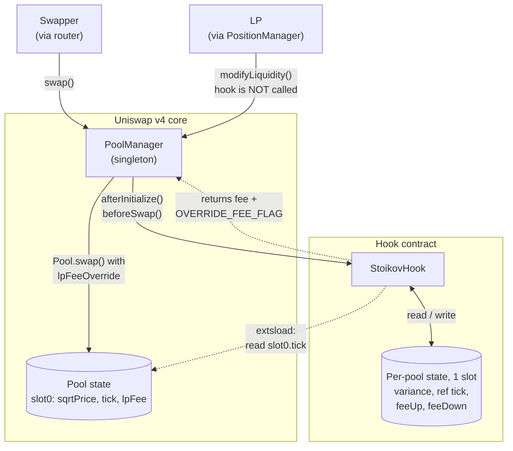
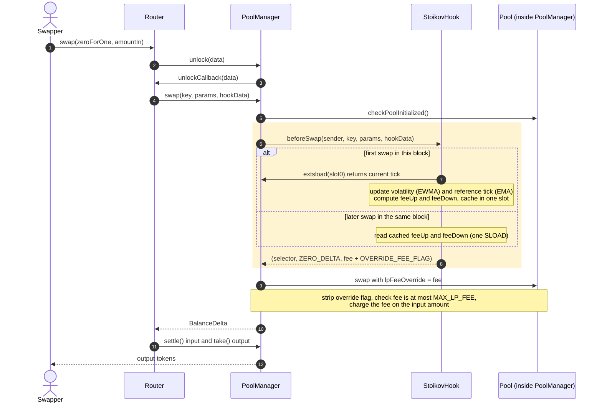

<p align="center">
  
</p>

# StoikovHook

**A Uniswap v4 hook that sets swap fees the way a professional market maker sets spreads. Fees widen with volatility and skew against the pool's inventory, which reduces the adverse-selection loss LPs take from arbitrage.**

> Built at ETHGlobal Tokyo 2026

> [!NOTE]
> **Project status: hook skeleton done, pricing model in progress.** The fee model is fully specified and approved in [`specs/01-design.md`](specs/01-design.md). The skeleton is implemented, tested and deployed on a local chain, and charges a fixed placeholder fee. The volatility and inventory pricing is not implemented yet.
> Status legend: ✅ Done · 🚧 In progress · 📋 Planned. Anything not marked ✅ is **not** done.

## Problem

A Uniswap pool is a market maker that never updates its quote. Its fee (its half-spread) is fixed when the pool is created, and its price only moves when someone trades against it. Between blocks, the price on centralized exchanges keeps moving. Once the gap exceeds the fee, an arbitrageur trades the pool back into line and the LPs fill that trade at a stale price. This loss is known as *loss-versus-rebalancing* (LVR). It grows with the square of volatility, and a static fee is mis-sized in both directions: too expensive for ordinary traders in calm markets, and far too cheap for arbitrageurs when volatility spikes.

A professional market maker on a centralized exchange does not quote passively. In the Avellaneda–Stoikov model, the dealer widens the spread when volatility rises and shifts both quotes against its inventory. That makes trades which rebalance its position cheap and trades which worsen it expensive. Uniswap LPs have neither tool.

## Solution

StoikovHook gives a v4 pool both tools. For every block it computes two fees from the pool's own on-chain state: one for swaps that push the price up and one for swaps that push it down. A volatility premium raises both fees when the market is moving. An inventory skew charges more to swaps that push the pool further from its recent equilibrium and less to swaps that bring it back. The fee is applied per swap through v4's dynamic-fee override. There is no oracle, no admin key, and the hook never takes custody of tokens.

## Goals

Each goal is a measurable outcome with a named way to check it. None is achieved yet (📋). Results will be published here **whether or not** they meet the goal.

| # | Goal | How it is verified | Status |
|---|---|---|---|
| G1 | **Better LP outcome for the same cost to traders.** Under identical order flow (same price path, same arbitrage and uninformed trades), LPs in the StoikovHook pool end with a higher terminal value, marked to the reference price, than LPs in a static-fee pool charging the same average fee to uninformed traders. Results against static 0.05% and 0.30% pools are reported alongside. | Deterministic Foundry scenario comparing four pools ([spec §6, M3](specs/01-design.md#61-mvp-must-ship-for-the-demo)) | 📋 Planned |
| G2 | **Direction-aware fees on a live network.** On Sepolia, swaps in opposite directions pay different fees, as recorded in the `fee` field of the PoolManager's own `Swap` event. | Published transaction hashes, verified hook source | 📋 Planned |
| G3 | **The hook never blocks trading.** Every fee stays within [0.01%, 1%], and no swap reverts inside the hook. | Fuzz tests (≥ 1,000 runs) over random swap sequences and time gaps | 📋 Planned |
| G4 | **Low gas overhead.** ≤ 5,000 gas for swaps that reuse the block's cached fees, and ≤ 25,000 gas for the first swap of a block. | Foundry gas snapshots, recorded in the build log | 📋 Planned |

## Architecture

> 🚧 In progress. The diagrams show the design in [`specs/01-design.md`](specs/01-design.md); the implementation will follow it.

**(a) Components.** Solid arrows are calls; dotted arrows are return values and read-only access.



**(b) Lifecycle of one swap.** The highlighted block is where StoikovHook runs. It is called in step 6, reads the pool's tick in step 7 (first swap of a block only) and returns the fee override in step 8.



## Core Features

| Feature | Description | Status |
|---|---|---|
| Project scaffolding | Foundry project built on the v4 template, with compiler settings pinned so the CREATE2-mined hook address is reproducible. | ✅ Done |
| Hook skeleton | `afterInitialize` + `beforeSwap` permissions (address flags `0x1080`), a dynamic-fee guard, a stored fallback fee of 0.05%, and a per-swap fee override that currently charges a fixed 0.30% placeholder. | ✅ Done |
| Dynamic fee computation | Each block has two fees, one for price-up swaps and one for price-down swaps, applied per swap through v4's `OVERRIDE_FEE_FLAG`. | 🚧 In progress (spec approved, code not started) |
| Inventory skew | Swaps that push the pool away from its recent equilibrium (an EMA of its own tick) pay more, and swaps that bring it back pay less. | 🚧 In progress (spec approved, code not started) |
| Volatility estimation | On-chain EWMA of realized volatility from the pool's own ticks, updated once per block, with no oracle. | 🚧 In progress (spec approved, code not started) |
| Fee bounds protection | Every fee is clamped to a floor and a cap (default 0.01%–1%), and the fee calculation is designed never to revert a swap. | 🚧 In progress (spec approved, code not started) |
| Per-block fee snapshot | Fees are fixed for the whole block, so trading back and forth within a block cannot lower your own fee. | 🚧 In progress (spec approved, code not started) |
| Test suite | Unit, fuzz (≥ 1,000 runs) and gas-snapshot tests for the hook. | 📋 Planned |
| Comparison simulation | A deterministic scenario that runs identical order flow through StoikovHook and through static-fee pools, including a fee-matched baseline, and reports LP value, fee income and arbitrage profit. | 📋 Planned |
| Sepolia deployment | Hook deployed at a mined address with flags `0x1080`, source verified, and a demo pool with swaps in both directions. | 📋 Planned |

## Non-Goals

What StoikovHook deliberately does **not** do:

- **No price oracle and no keeper.** The hook only reads the pool's own on-chain state. There are no Chainlink or Pyth feeds and no off-chain bot pushing updates.
- **No trading frontend.** You interact through scripts and existing v4 routers. A read-only fee dashboard is at most a stretch idea, not a trading UI.
- **No custom curve and no token custody.** The hook never changes swap amounts (no return-delta flags), never holds tokens and never runs on liquidity add/remove.
- **No admin, governance or upgradeability.** Parameters are fixed at deployment; a different parameter set means a new hook and a new pool.
- **Not a full LVR solution.** The aim is to shrink the share of LVR that arbitrageurs capture, not to eliminate it. This is not an MEV auction, a batch auction or an oracle-priced AMM.
- **No mainnet deployment and no production calibration.** The hook runs on Sepolia only, is unaudited, and its default parameters are placeholders until calibrated.

## How It Works

> 🚧 In progress. This describes the design; parameter values are placeholders until calibration.

Picture the pool as a currency-exchange booth that posts two prices, one for buying ETH and one for selling it.

1. **Calm market: small fee.** When prices barely move, both directions pay a low base fee, so ordinary traders are not overcharged.
2. **Choppy market: both fees rise.** Fast-moving prices are when arbitrage bots profit at LPs' expense, so the booth charges a higher premium on both sides, much as insurance costs more in storm season. The premium follows how much the pool's own price has been moving recently.
3. **Unbalanced booth: prices tilt.** If the booth has recently sold a lot of ETH, its price has risen above its recent average. It then charges more to anyone buying even more ETH and gives a discount to anyone selling ETH back. Trades that help the pool recover its balance are cheaper; trades that push it further out are more expensive.
4. **One price list per block.** Both fees are set at the first trade of each block and stay fixed until the next block. Trading back and forth within a block therefore cannot move your own fee.
5. **Always a floor and a cap.** Fees never go below a minimum or above a maximum (defaults 0.01% and 1%), so the pool stays usable even in a crash.

The math behind each step, and why it follows the Avellaneda–Stoikov model, is in [`specs/01-design.md`](specs/01-design.md) §2.

## Tech Stack

- **Solidity** 0.8.30. Compiler settings are pinned in `foundry.toml` because the CREATE2-mined hook address depends on the exact bytecode.
- **Foundry** (forge, anvil, cast) for building, testing, the local Sepolia fork and deployment.
- **Uniswap v4-core / v4-periphery**, pulled in through OpenZeppelin **uniswap-hooks** v1.1.0 (hook base contracts).
- **hookmate** for v4 deployment artifacts and address constants.
- **Sepolia** as the target testnet.

## Repository Guide

> 🚧 In progress. File paths and line numbers will be filled in as each part is implemented, in the format `src/StoikovHook.sol:L120-L145`.

| What to verify | Location | Status |
|---|---|---|
| Hook permissions (`afterInitialize` + `beforeSwap`, address flags `0x1080`) | `src/StoikovHook.sol:L15` — flag constant shared with the deploy script and tests; `lib/uniswap-hooks/src/fee/BaseOverrideFee.sol:L75-L92` — inherited permission set | ✅ Done |
| Dynamic-fee guard and stored fallback fee (`afterInitialize`) | `src/StoikovHook.sol:L40-L48` — rejects static-fee pools, stores 0.05% as the fallback LP fee | ✅ Done |
| Per-swap fee override returned from `beforeSwap` | `src/StoikovHook.sol:L52-L59` — fee source (placeholder); `lib/uniswap-hooks/src/fee/BaseOverrideFee.sol:L67` — adds `OVERRIDE_FEE_FLAG` | ✅ Done (fixed placeholder fee) |
| Fee formula: volatility premium, inventory skew, clamps | `src/StoikovHook.sol:L?` | 🚧 In progress |
| Estimator update at window open (EWMA volatility, EMA reference) and per-pool state seeding | `src/StoikovHook.sol:L?` | 🚧 In progress |
| Address mining and CREATE2 deployment | `script/00_DeployHook.s.sol:L18-L31` — mines with the shared flag constant, deploys via CREATE2 | ✅ Done (local anvil); Sepolia 🚧 |
| Skeleton tests | `test/StoikovHook.t.sol:L66-L157` — flags vs. permissions, fallback fee, static-fee rejection, override fee in both directions, 1,000-run fuzz against static pools, access control | ✅ Done |
| Fee-model and scenario tests | `test/…` | 🚧 In progress |
| Design specification | [`specs/01-design.md`](specs/01-design.md) | ✅ Approved |

## Getting Started

Prerequisites: [Foundry](https://book.getfoundry.sh/getting-started/installation) and git.

```bash
git clone --recurse-submodules https://github.com/tonycai/StoikovHook.git
cd StoikovHook
forge install   # only needed if you cloned without --recurse-submodules
forge build
forge test
```

`forge test` runs 12 tests: 6 for the StoikovHook skeleton, including a 1,000-run fuzz test, and 6 for the template's position-manager helpers. Tests for the pricing model are 🚧 in progress.

Note: `forge test` also prints `error: file src/base/BaseHook.sol not found`. This is a known, harmless toolchain diagnostic; the build and every test succeed (see [`FEEDBACK.md`](FEEDBACK.md)).

Local Sepolia fork, for the deployment flow:

```bash
# Put your own Sepolia RPC endpoint in SEPOLIA_RPC_URL. Never commit it.
# --block-time 1 keeps block timestamps moving while anvil is idle.
anvil --fork-url "$SEPOLIA_RPC_URL" --block-time 1
```

Deploy the hook to a local chain. anvil's accounts are unlocked, so no private key is needed:

```bash
anvil --block-time 1
# in a second terminal
forge script script/00_DeployHook.s.sol --rpc-url http://127.0.0.1:8545 \
  --unlocked --sender 0xf39Fd6e51aad88F6F4ce6aB8827279cffFb92266 --broadcast \
  --gas-limit 100000000000 --disable-block-gas-limit
```

🚧 In progress: the Sepolia deployment and the pool, liquidity and swap scripts (`01`–`03`) running end to end against it. Keys will only be used through a Foundry keystore (`--account`).

## Deployed Contracts

🚧 In progress. Nothing is deployed yet.

| Network | Contract | Address | Explorer |
|---|---|---|---|
| Sepolia (11155111) | StoikovHook | 🚧 | 🚧 |
| Sepolia (11155111) | Demo pool (PoolId) | 🚧 | 🚧 |

## Demo

🚧 In progress. The video link will be added here.

## Built With AI

This project was built with Claude Code CLI as the execution layer, under a spec-driven workflow. Everything AI-assisted is traceable in this repository:

| Artifact | Location | What it shows |
|---|---|---|
| Design spec | [`specs/01-design.md`](specs/01-design.md) | The fee model and interface decisions, written and reviewed before implementation |
| AI collaboration rules | [`CLAUDE.md`](CLAUDE.md) | Constraints the agent operates under, including safety rules for fee logic and key handling |
| Build log | [`docs/BUILD_LOG.md`](docs/BUILD_LOG.md) | Timestamped record of every task: goal, outcome, problems hit, resolution |
| Commit history | `git log` | Small incremental commits, each tied to a working state |

Human review gates: every change to fee computation, hook permissions or anything that touches funds is reviewed diff by diff before it is merged.

Decisions made by the author:

- **Project concept**: applying Avellaneda–Stoikov inventory and volatility logic to Uniswap v4 dynamic fees to reduce LPs' adverse-selection loss.
- **Engineering constraints**: pinned compiler settings for deterministic CREATE2 hook addresses, keystore-only key handling, spec-first development and small commits (see [`CLAUDE.md`](CLAUDE.md)).
- **Block-number fee windows**, chosen over the agent's proposed timestamp windows because block producers can nudge timestamps.
- **The fee-matched static pool** as the comparison baseline.
- **The parameter defaults.**

The agent proposed, and the author approved: the oracle-free reference price and per-block fee caching. Every spec decision is recorded in [`specs/01-design.md`](specs/01-design.md) §7.

The full breakdown of what the agent did and what the author did is in [`AI_USAGE.md`](AI_USAGE.md).

## Author

Built solo at ETHGlobal Tokyo 2026 by Tony Cai, founder of SolanaLink Co., Ltd. (Tokyo). Tony has 20+ years in software engineering, with a background in distributed systems and market-making infrastructure.

| | |
|---|---|
| X / Twitter | [@TonyIronTokyo](https://x.com/TonyIronTokyo) |
| Discord | `tonyiron2025` |
| GitHub | [@tonycai](https://github.com/tonycai) |
